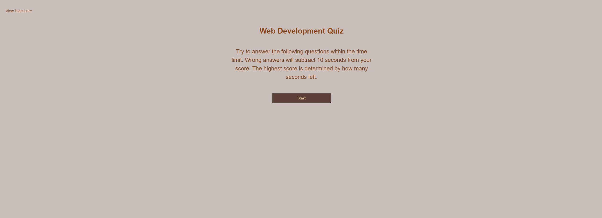

# Lighting-Round

## Description
This repository is designed to showcase the ability to use HTML, CSS, and Vanilla Javascript with the creation of a site from scratch that quizzes the user on Javascript concepts.

## Installation
* Most recent version of VS code

## Usage

User can test their knowledge of Javascript using this site, or can inspect the code and view how everything comes together.

## Credits

* Rbustan0 (Roye Bustan)

## License

* MIT license

## Deployment

[Link to Deployed Webpage](https://rbustan0.github.io/Lighting-Round/)  

[Link to Github User](https://github.com/Rbustan0)   

## Screenshots

### Note: This is not the full quiz. Just showcasing that the pages present and show. If you want to take the actual quiz click on the deployed website link.   

